# ☕ CoffeeApp

<p align="center">
  <b>A modern full-stack Coffee Ordering Android application built with Jetpack Compose, Node.js, Express.js, and MongoDB Atlas.</b>
</p>

<p align="center">
  
  
  
  
  
</p>

---

## 📖 Overview

CoffeeApp is a **full-stack Android application** that allows users to browse coffee products, search and filter items, manage their cart and favorites, place orders, and track order history through a clean and modern Material 3 interface.

The application follows the **MVVM architecture** on Android and communicates with a **Node.js + Express REST API** backed by **MongoDB Atlas**. Secure authentication is implemented using **JWT**, with persistent login powered by **DataStore**.

---

# ✨ Features

### 🔐 Authentication
- User Registration
- Secure Login
- JWT Authentication
- Persistent Login (DataStore)
- Logout

### ☕ Coffee Ordering
- Browse Coffee Menu
- Search Products
- Category Filtering
- Product Details
- Add to Cart
- Favorites

### 🛒 Shopping Cart
- Update Quantity
- Remove Items
- Dynamic Total Price
- Checkout Flow

### 📦 Orders
- Place Orders
- Order History
- Order Details

### 👤 Profile
- Dynamic User Profile
- Dark / Light Theme
- About App

### 🎨 User Experience
- Material 3 UI
- Responsive Design
- Loading States
- Empty States
- Smooth Navigation

---

# 📥 Download APK

You can download and install the latest Android APK from the GitHub Releases page.

➡️ **[Download Latest APK](https://github.com/cipherByte7/CoffeeApp/releases/latest)**

> **Note:** Android may ask you to allow installation from unknown sources because the app isn't distributed through the Google Play Store.

---

# 📱 Screenshots

<table align="center">
  <tr>
    <td align="center">
      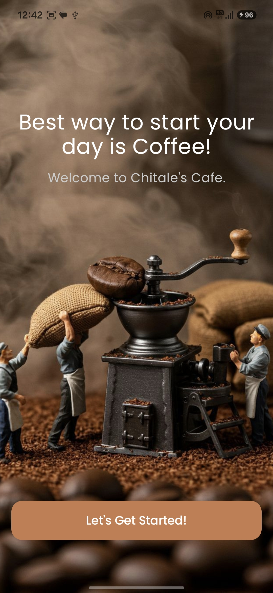<br>
      <b>Welcome</b>
    </td>
    <td align="center">
      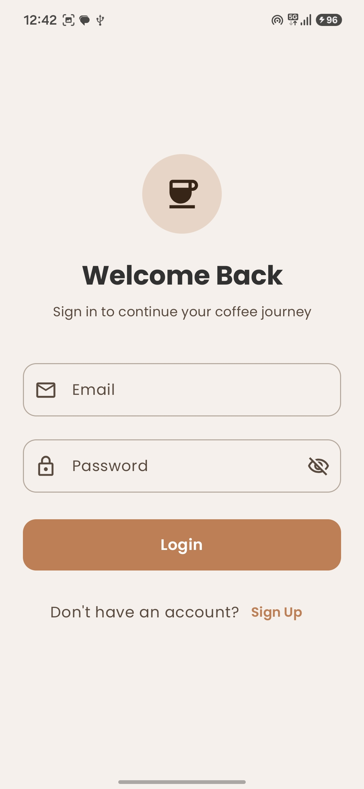<br>
      <b>Login</b>
    </td>
    <td align="center">
      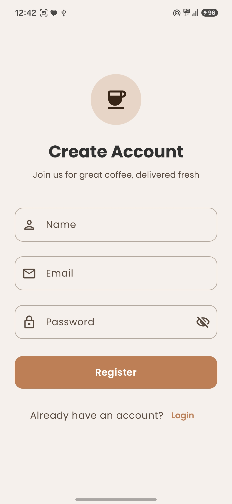<br>
      <b>Register</b>
    </td>
  </tr>

  <tr>
    <td align="center">
      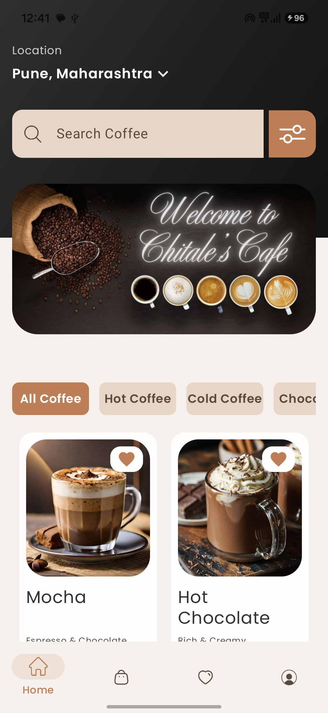<br>
      <b>Home</b>
    </td>
    <td align="center">
      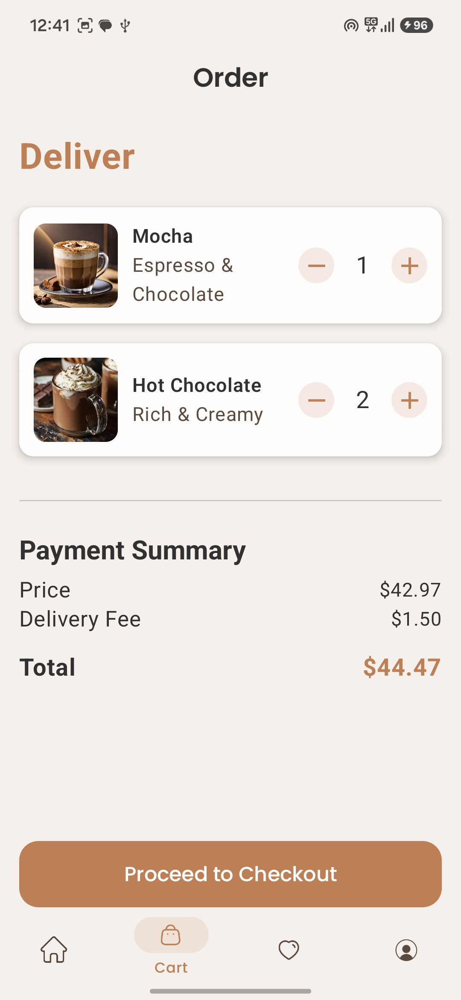<br>
      <b>Cart</b>
    </td>
    <td align="center">
      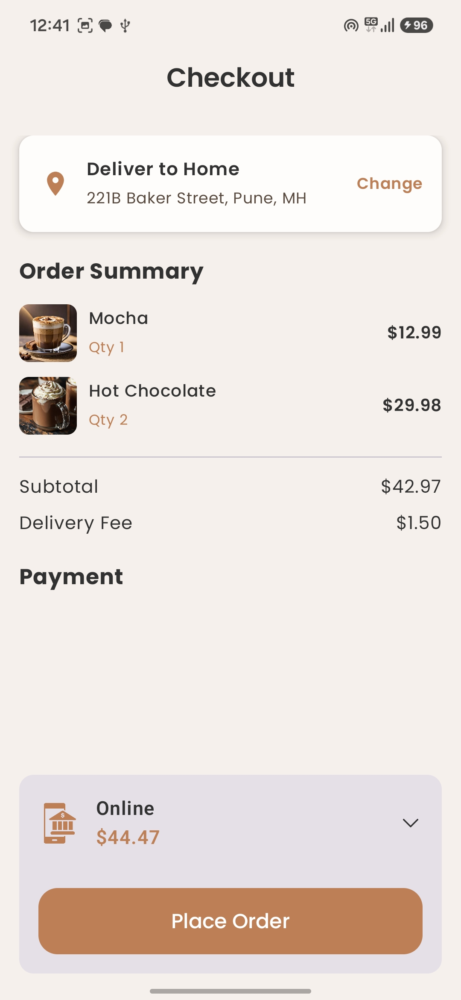<br>
      <b>Checkout</b>
    </td>
  </tr>

  <tr>
    <td align="center">
      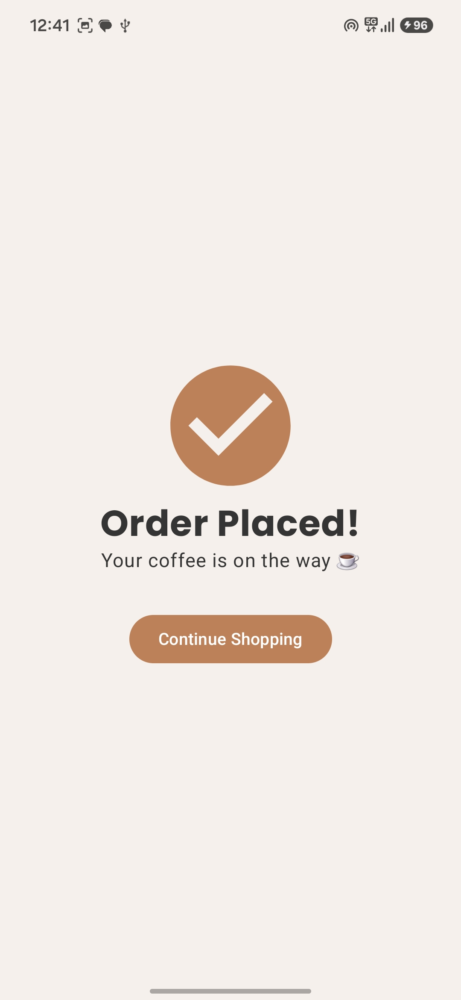<br>
      <b>Order Success</b>
    </td>
    <td align="center">
      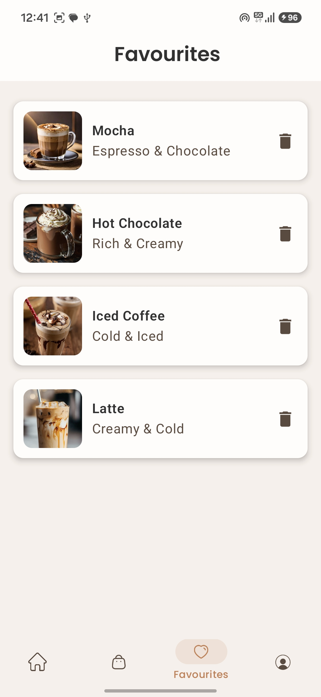<br>
      <b>Favorites</b>
    </td>
    <td align="center">
      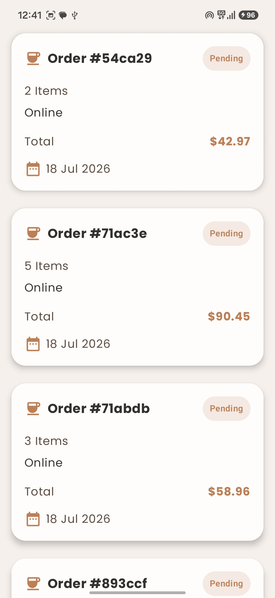<br>
      <b>Orders</b>
    </td>
  </tr>

  <tr>
    <td align="center">
      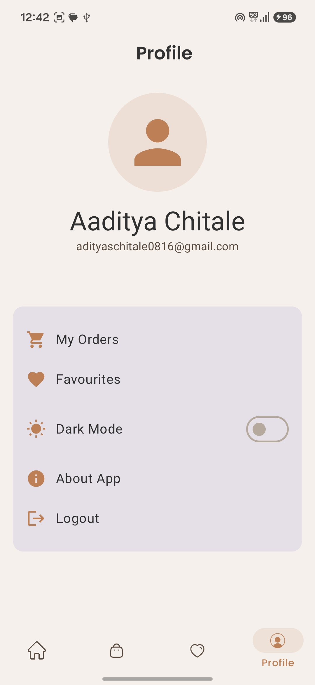<br>
      <b>Profile</b>
    </td>
    <td align="center">
      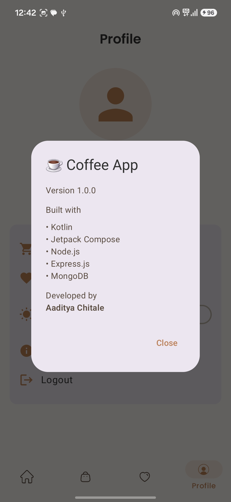<br>
      <b>About App</b>
    </td>
    <td></td>
  </tr>
</table>---

# 🏗️ Architecture

```
Presentation (Jetpack Compose)
          │
          ▼
      ViewModel
          │
          ▼
      Repository
          │
          ▼
      Retrofit API
          │
          ▼
 Node.js + Express API
          │
          ▼
    MongoDB Atlas
```

---

# 🔄 Application Flow

```
User
  │
  ▼
Jetpack Compose UI
  │
  ▼
ViewModel
  │
  ▼
Repository
  │
  ▼
Retrofit
  │
  ▼
REST API
  │
  ▼
Express Server
  │
  ▼
MongoDB Atlas
```

---

# 🛠 Tech Stack

## Android
- Kotlin
- Jetpack Compose
- Material 3
- MVVM Architecture
- Navigation Compose
- Retrofit
- Coroutines
- DataStore
- Coil

## Backend
- Node.js
- Express.js
- MongoDB Atlas
- Mongoose
- JWT Authentication
- BCrypt
- CORS

---

# 📂 Project Structure

```
CoffeeApp
│
├── backend
│   ├── config
│   ├── controllers
│   ├── middleware
│   ├── models
│   ├── routes
│   └── server.js
│
├── frontend
│   ├── data
│   ├── domain
│   ├── network
│   ├── presentation
│   └── ui
│
├── screenshots
└── README.md
```

---

# 🔐 Authentication Flow

```
Login/Register
      │
      ▼
JWT Generated
      │
      ▼
Saved in DataStore
      │
      ▼
Authorization Header
      │
      ▼
Authenticated API Requests
```

---

# 💡 Challenges Solved

- Designed a scalable MVVM architecture.
- Built a RESTful backend with Express.js and MongoDB Atlas.
- Implemented JWT authentication with persistent login.
- Integrated Retrofit for authenticated API communication.
- Managed application state with ViewModels and Coroutines.
- Added responsive layouts, loading states, and empty states.
- Implemented Material 3 design with Dark Mode.
- Deployed the backend on Render.

---

# 🚀 Getting Started

### Clone the Repository

```bash
git clone https://github.com/cipherByte7/CoffeeApp.git
```

### Backend

```bash
cd backend
npm install
npm run dev
```

### Android

Open the `frontend` project in Android Studio, update the API base URL if required, and run the application.

---

# 🔮 Future Improvements

- Online Payments
- Push Notifications
- Address Management
- Product Reviews & Ratings
- Coupons & Offers
- Admin Dashboard
- Google Sign-In
- Firebase Cloud Messaging

---

# 👨‍💻 Author

**Aaditya Chitale**

- GitHub: https://github.com/cipherByte7
- LinkedIn: www.linkedin.com/in/aaditya-chitale-41287528b

---

## ⭐ Support

If you like this project, consider giving it a **Star ⭐** on GitHub. Your support is appreciated!
